# dotnetconf-2025_devpira-2026-01
Photos and information from the local edition of .NET Conf 2025 in Piracicaba-SP, an event that took place on 01/10/2026.

Organizers:
- **Alexandre Ballestero de Paula (DEVPIRA)**
- **Renato Groffe (Microsoft MVP, Docker Captain, Grafana Champion, APISec U Ambassador, MTAC)**
- **Fábio Baldin (DEVPIRA)**
- **Murilo Beltrame (DEVPIRA)**

Number of participants: **30 people**

---

Presentations/panels that took place during the event:

_# MCPs + .NET 10: from implementation to managing integrations with AI_

Speaker: **Renato Groffe (Microsoft MVP, Docker Captain, Grafana Champion, APISec U Ambassador, MTAC)**

Technologies and topics covered: **.NET 10, C#, MCP, Artificial Intelligence, Visual Studio Code, Linux, Microsoft Foundry, Grafana, Grafana Tempo, Docker, Docker Compose, Redis, Azure Redis Cache, PostgreSQL, Azure Monitor, Application Insights...**

_# Still using Controllers? Build APIs using only Minimal APIs in .NET!_

Speaker: **Márcio Nizzola (Microsoft MVP)**

Technologies and topics covered: **.NET 10, C#, ASP.NET Core, OpenAPI, Visual Studio...**

_# Building a solid career in .NET: market, study and hype_

Speaker: **Beatriz Tavernaro (Gold Microsoft Learn Student Ambassador)**

Technologies and topics covered: **.NET, C#, ASP.NET Core, Visual Studio...**

_# Panel: Questions about a Career in Software Development: trending technologies, what to study, tips for career updates..._

Participants:
- **Alexandre Ballestero de Paula (DEVPIRA)**
- **Renato Groffe (Microsoft MVP, Docker Captain, Grafana Champion, APISec U Ambassador, MTAC)**
- **Márcio Nizzola (Microsoft MVP)**
- **Beatriz Tavernaro (Gold Microsoft Learn Student Ambassador)**

Technologies and topics covered: **.NET, C#, ASP.NET Core, Artificial Intelligence, International Career, Cloud Computing...**

---

Access this [**link**](/img/) to view all photos from the presentations.

Form used for registrations: [**Eventiza**](https://eventiza.com.br/evento/net-conf-2025-devpira)

Location: **Anhanguera University - Rua Santa Catarina, 1005 - Vila Gertrudes - Piracicaba-SP - CEP: 04705-000**

We would like to thank **Prof. Thalita Moschini Cavalcanti Terrini (Anhanguera University)** for the opportunity and all the support to promote this local edition of .NET Conf in Piracicaba-SP. And also our sincere thanks to **André Baltieri (Microsoft MVP, Balta.io) and Gregory Buso (Balta.io)** for all the help in sponsoring the event.

---

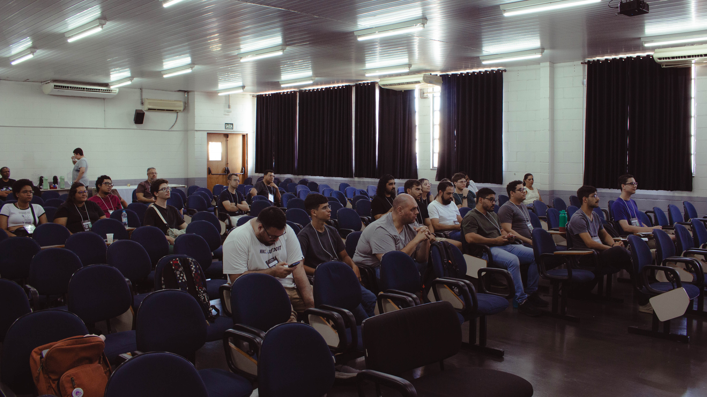

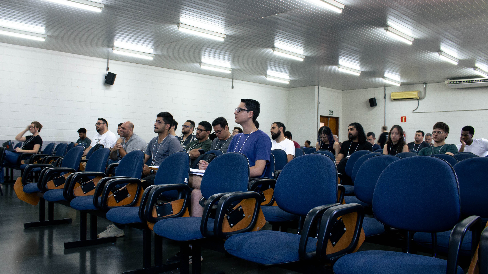

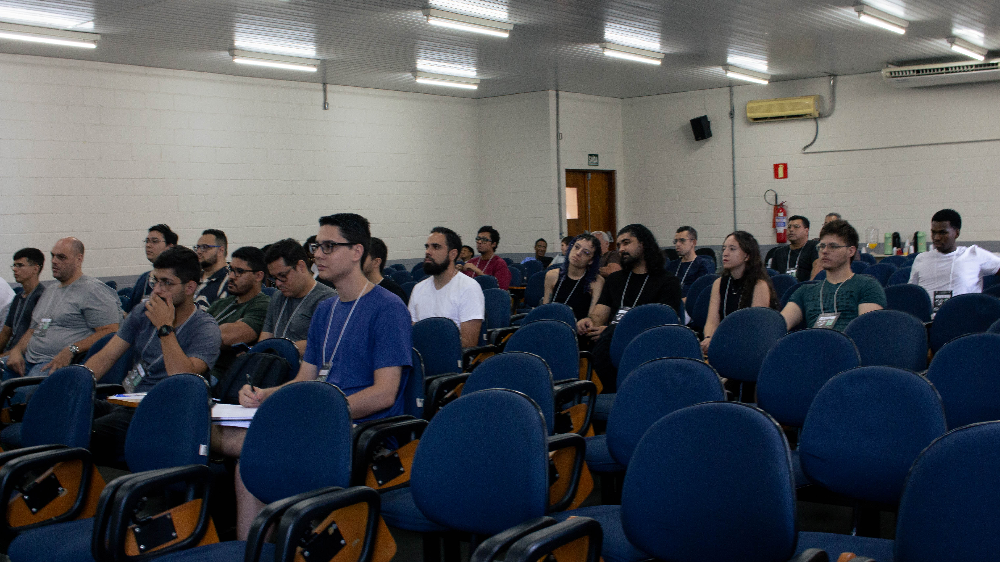

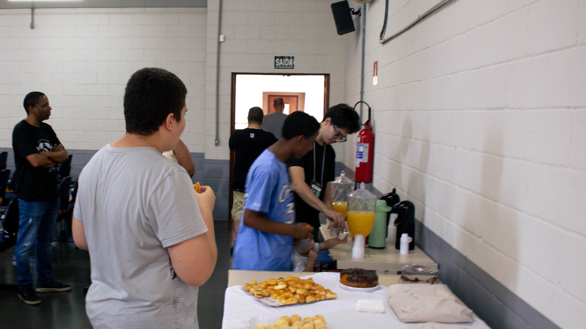

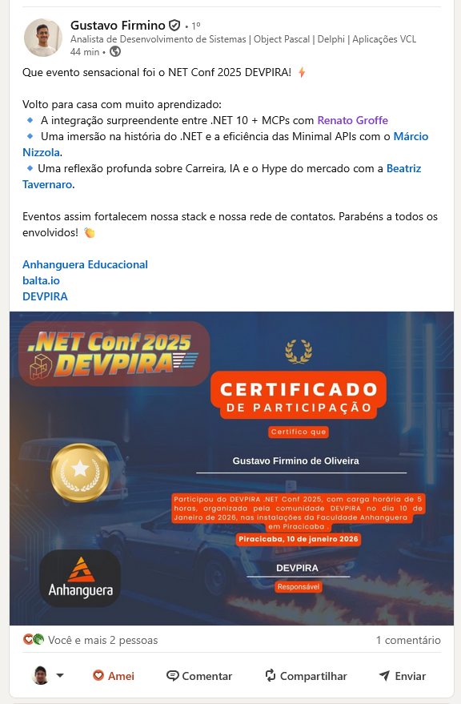

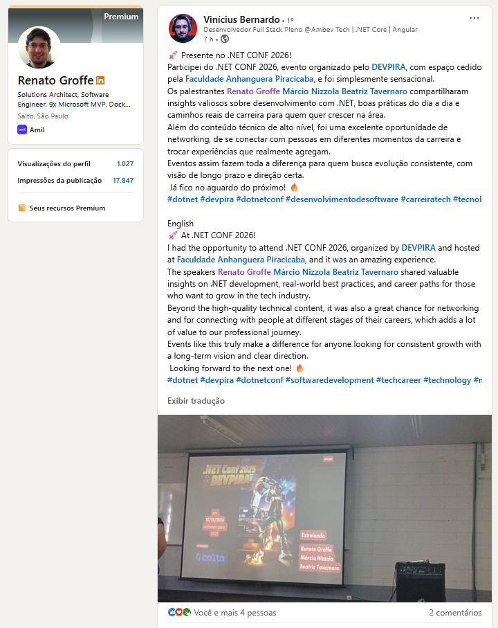

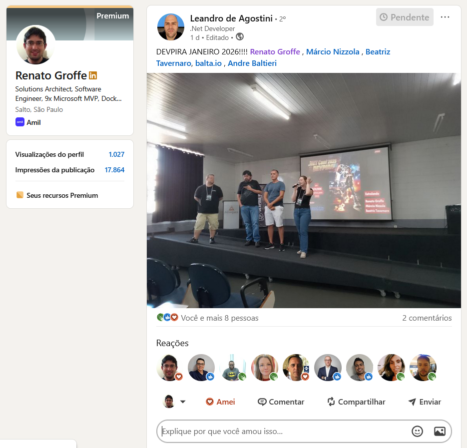

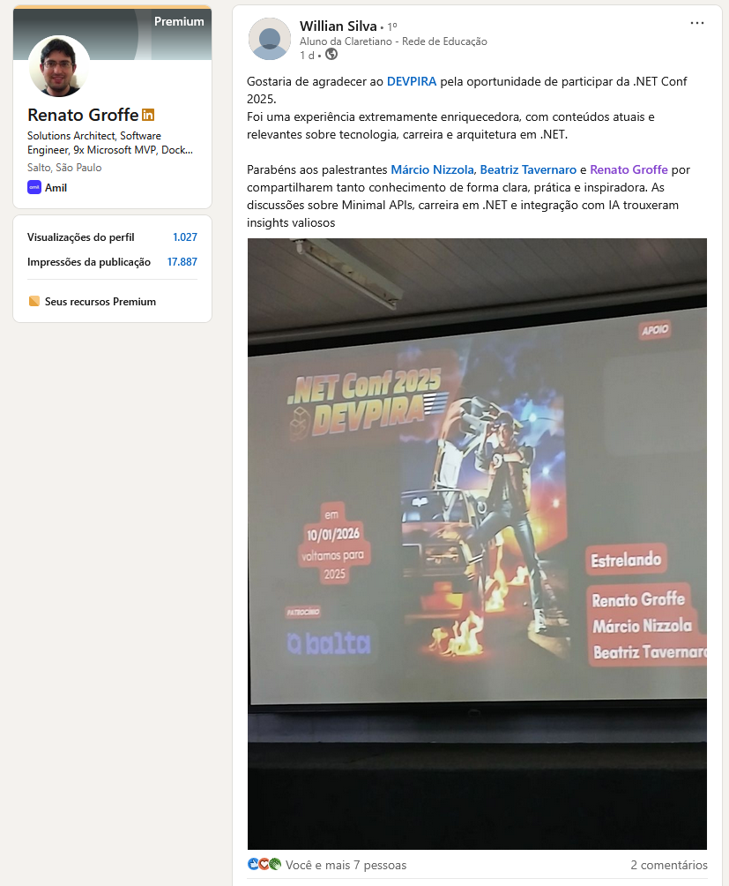

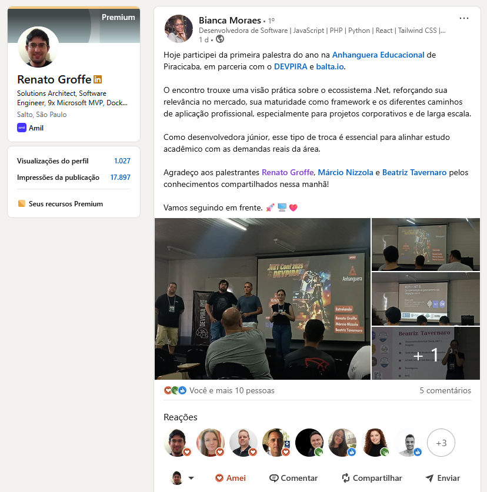

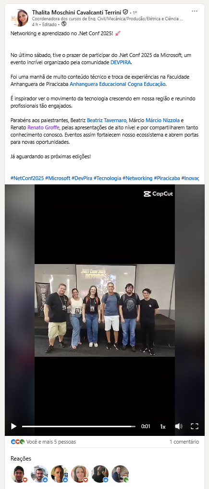

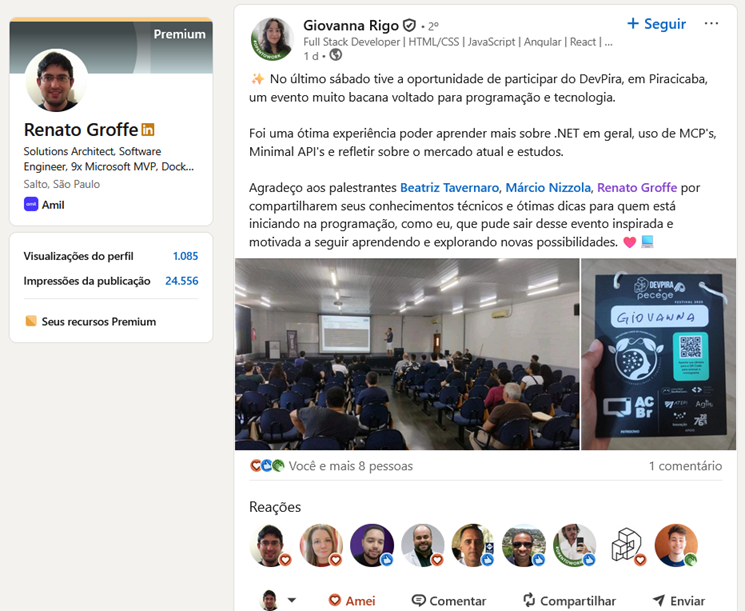

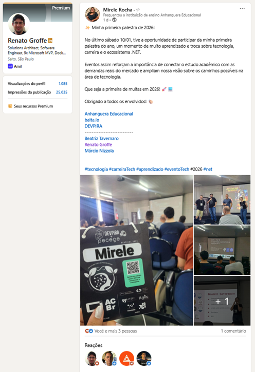

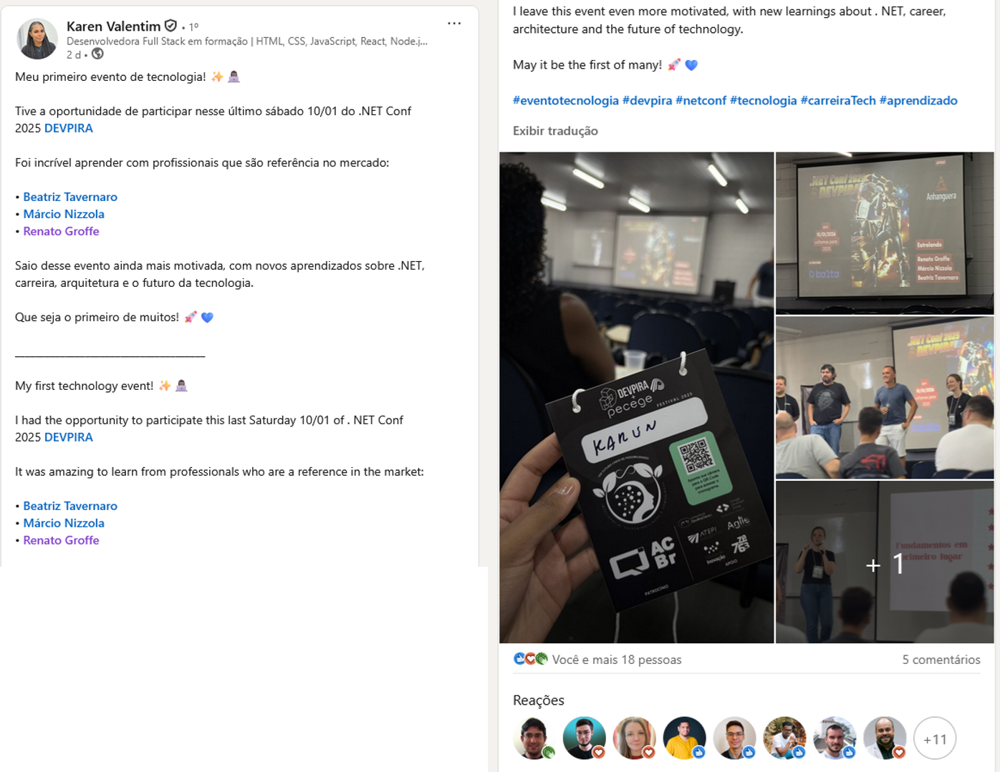
