# dotnetconf-2025_devpira-2026-01
Fotos e informações da edição local do .NET Conf 2025 em Piracicaba-SP, um evento que aconteceu no dia 10/01/2026.

Organizadores:
- **Alexandre Ballestero de Paula (DEVPIRA)**
- **Renato Groffe (Microsoft MVP, Docker Captain, Grafana Champion, APISec U Ambassador, MTAC)**
- **Fábio Baldin (DEVPIRA)**
- **Murilo Beltrame (DEVPIRA)**

Número de participantes: **30 pessoas**

---

Apresentações/painéis que aconteceram durante o evento:

_# MCPs + .NET 10: da implementação ao gerenciamento das integrações com IA_

Palestrante: **Renato Groffe (Microsoft MVP, Docker Captain, Grafana Champion, APISec U Ambassador, MTAC)**

Tecnologias e tópicos abordados: **.NET 10, C#, MCP, Inteligência Artificial, Visual Studio Code, Linux, Microsoft Foundry, Grafana, Grafana Tempo, Docker, Docker Compose, Redis, Azure Redis Cache, PostgreSQL, Azure Monitor, Application Insights...**

_# Ainda usa Controllers? Construa APIs somente usando Minimal APIs no .NET!_

Palestrante: **Márcio Nizzola (Microsoft MVP)**

Tecnologias e tópicos abordados: **.NET 10, C#, ASP.NET Core, OpenAPI, Visual Studio...**

_# Construindo uma carreira sólida em .NET: mercado, estudo e hype_

Palestrante: **Beatriz Tavernaro (Gold Microsoft Learn Student Ambassador)**

Tecnologias e tópicos abordados: **.NET, C#, ASP.NET Core, Visual Studio...**

_# Painel: Dúvidas sobre a Carreira em Desenvolvimento de Software: tecnologias em alta, o que estudar, dicas para atualização na carreira..._

Participantes:
- **Alexandre Ballestero de Paula (DEVPIRA)**
- **Renato Groffe (Microsoft MVP, Docker Captain, Grafana Champion, APISec U Ambassador, MTAC)**
- **Márcio Nizzola (Microsoft MVP)**
- **Beatriz Tavernaro (Gold Microsoft Learn Student Ambassador)**

Tecnologias e tópicos abordados: **.NET, C#, ASP.NET Core, Inteligência Artificial, Carreira no Exterior, Cloud Computing...**

---

Acesse este [**link**](/img/) para visualizar todas as fotos das apresentações.

Formulário utilizado para inscrições: [**Eventiza**](https://eventiza.com.br/evento/net-conf-2025-devpira)

Local: **Faculdade Anhanguera - Rua Santa Catarina, 1005 - Vila Gertrudes - Piracicaba-SP - CEP: 04705-000**

Deixamos aqui nossos agradecimentos à **Profa. Thalita Moschini Cavalcanti Terrini (Faculdade Anhanguera)** pela oportunidade e todo o apoio para promovermos esta edição local do .NET Conf em Piracicaba-SP. E também nosso muito obrigado ao **André Baltieri (Microsoft MVP, Balta.io) e ao Gregory Buso (Balta.io)** por todo o auxílio patrocinando o evento.

---

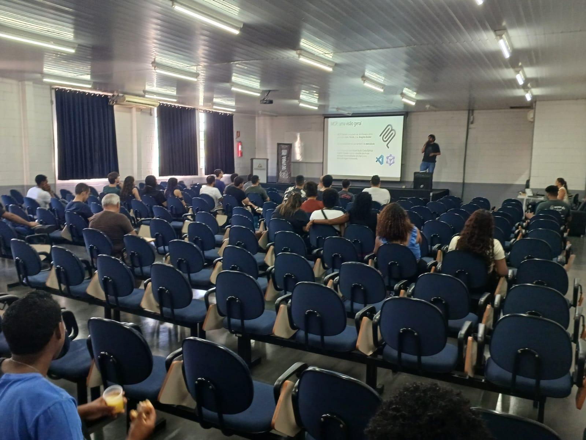

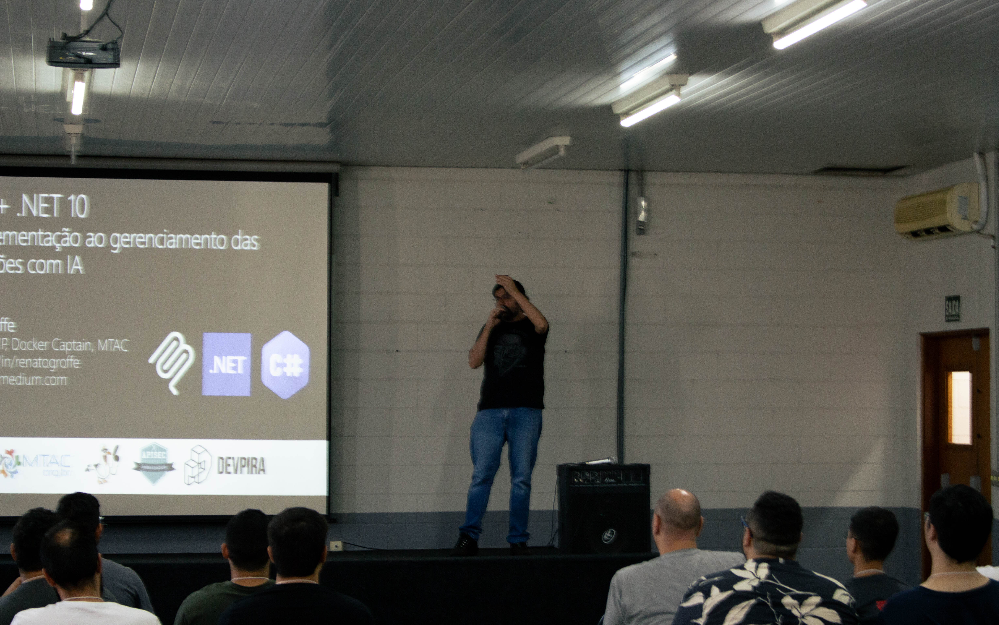

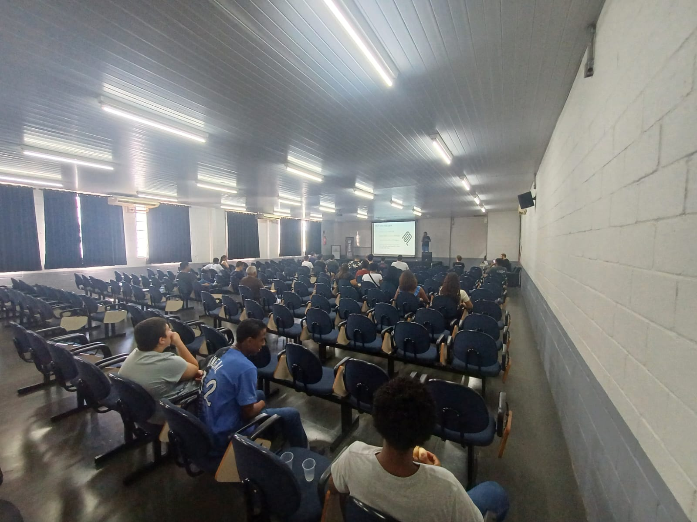

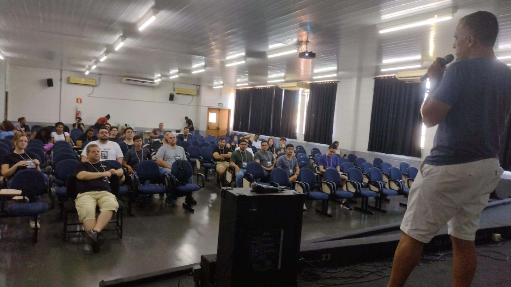

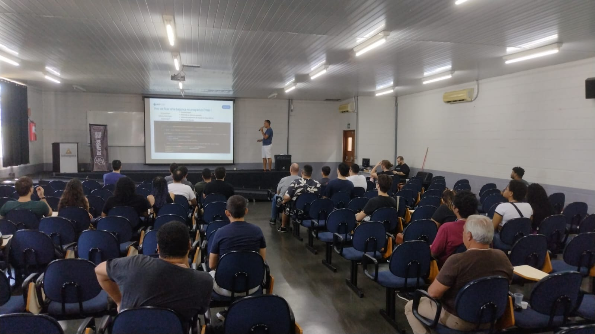

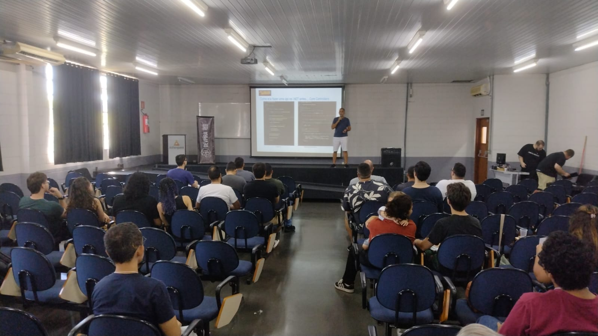

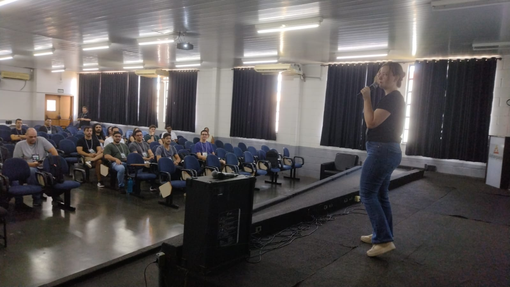

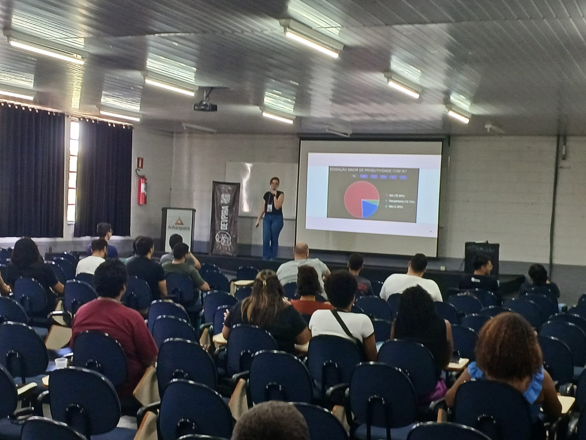

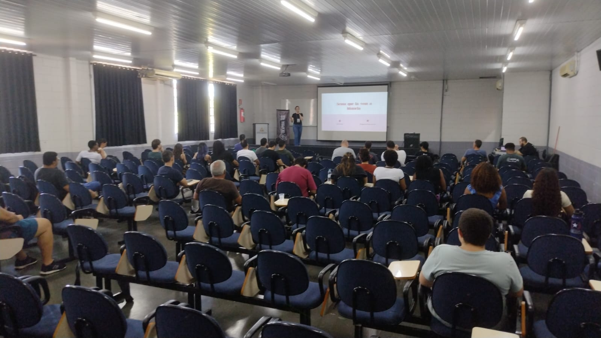

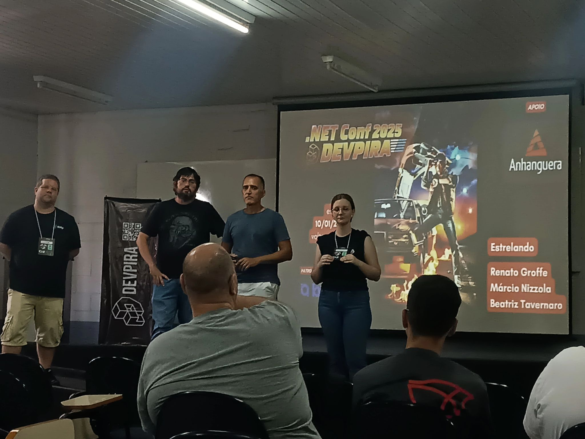

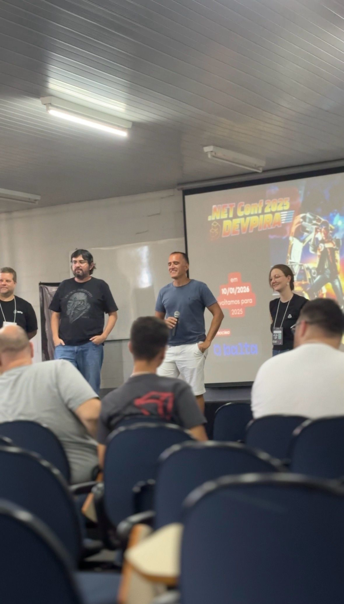

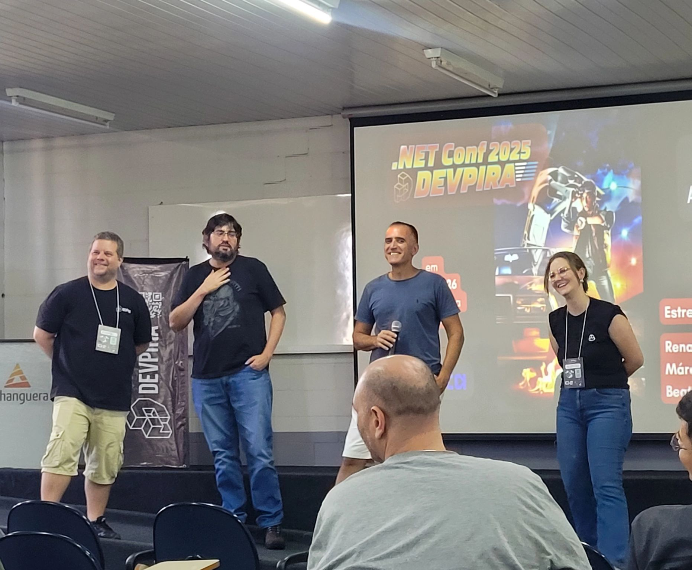

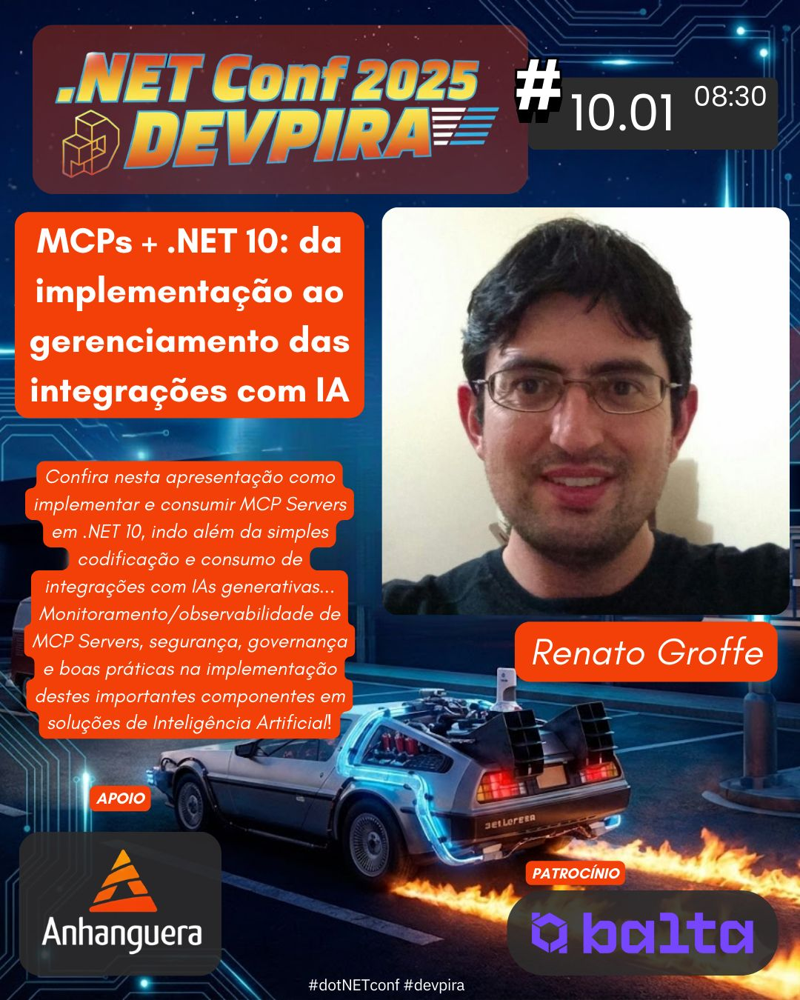

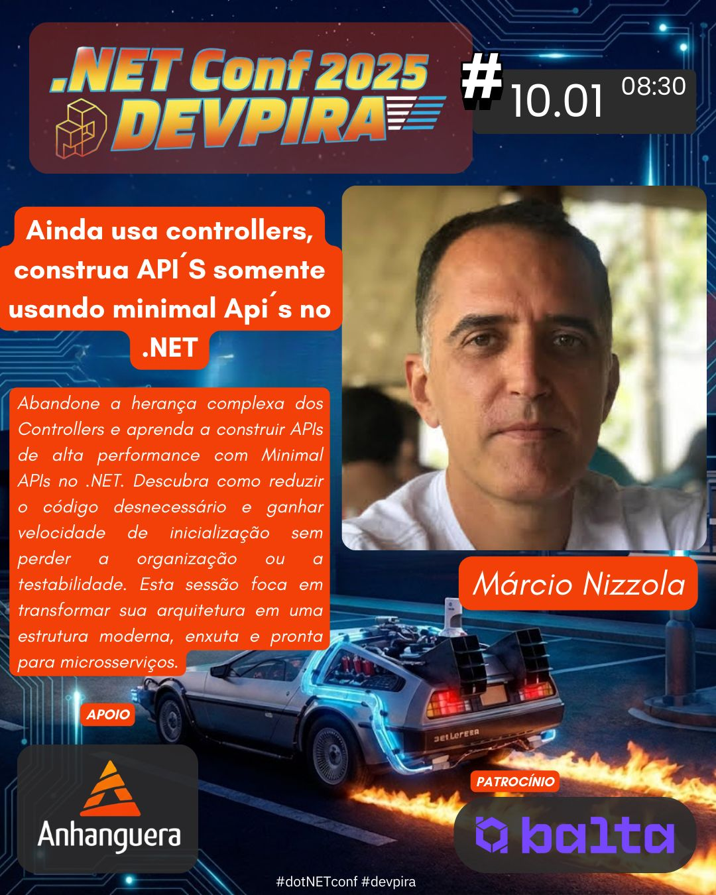

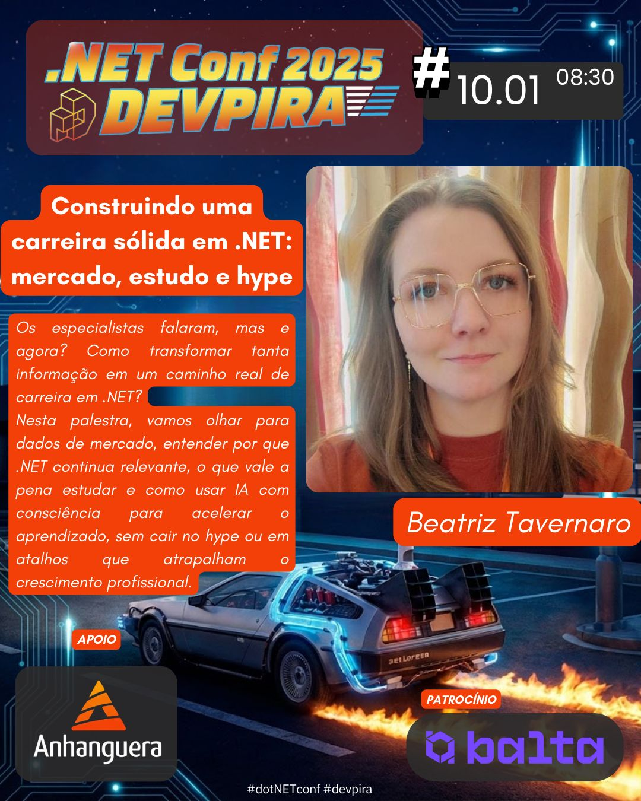